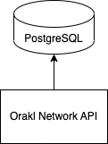

# Orakl Network API

## Description

The **Orakl Network API** is an abstraction layer representing a single source of truth for Orakl Network deployment. The code is located under [`api` directory](https://github.com/Bisonai/orakl/tree/master/api).&#x20;

The **Orakl Network API** has to be reachable from every Orakl Network service, and accessible to the [**Orakl Network CLI**](broken-reference). It is implemented as a REST web server that accept requests from other services, and the state of the Orakl Network is stored in PostgreSQL database. The **Orakl Network API** has to be launched and configured before any other microservice.

## Configuration

Before we launch the **Orakl Network API**, we must specify [few environment variables](https://github.com/Bisonai/orakl/blob/master/api/.env.example). The environment variables are automatically loaded from a `.env` file. Check example values from `.env.local` file

- `DATABASE_URL`
- `APP_PORT`
- `ENCRYPT_PASSWORD`
- `REDIS_HOST`
- `REDIS_PORT`

`DATABASE_URL` represents a [connection string](https://www.postgresql.org/docs/current/libpq-connect.html#LIBPQ-CONNSTRING) to a database that will hold the Orakl Network state.

> The format of `DATABASE_URL` should be `postgresql://[userspec@][hostspec][/dbname][?paramspec]`. An example string can look as follows `postgresql://bisonai@localhost:5432/orakl?schema=public.`&#x20;

`APP_PORT` represents a port on which the **Orakl Network API** will be running. This port will be necessary when we connect to **Orakl Network API** from other services.

`ENCRYPT_PASSWORD` is an encryption key used for encryption and decryption of private keys inserted to Orakl Network API.

`REDIS_HOST` and `REDIS_PORT` represent host and port of [Redis](https://redis.io/) to which the **Orakl Network API** connect to. The default values are `localhost` and `6379`, respectively. Redis is used to effectively save and load impermanent data

## Launch

To launch the **Orakl Network API** from source code in the production, one must first build the service, and then it can be launched.

```sh
yarn build
yarn start:prod
```

## Architecture

<figure><figcaption><p>Orakl Network API</p></figcaption></figure>
