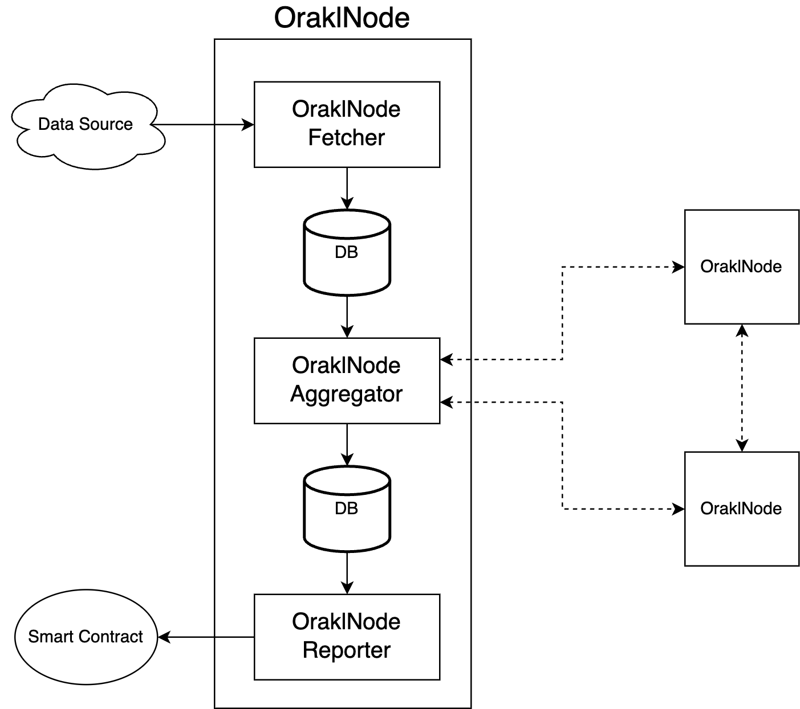

# Orakl Network Data Feed V2

## Description

The **Orakl Network Data Feed** is one of the main Orakl Network solutions. The goal of the **Orakl Network Data Feed** is to provide frequent data updates from off-chain to on-chain. The data feed is created from a submission pool that is composed of most up-to-date values reported by verified node operators.

A single data feed is defined by a pair of an adapter and an aggregator, and can be accessed on-chain through a `FeedProxy` smart contract. The `FeedProxy` is an auxiliary contract that redirects read requests to `Feed` contract. The `Feed` contract holds all submissions from all node operators, and aggregated value that is served to consumers through `FeedProxy` contract.

Every data feed is configured with 3 different intervals. `fetchInterval`, `aggregateInterval`, and `submitInterval`. Detailed specification for each feeds can be found in [orakl-config](https://github.com/Bisonai/orakl-config) as `configs.json` file. `OraklNode`, which stands for new datafeed performing off-chain aggregation, will execute each jobs based on defined intervals. Datafeed is updated once the finalized value have been generated off chain among OraklNodes.

The code is located under [`node` directory](https://github.com/Bisonai/orakl/tree/master/node) and it follows modular monolith pattern. The entrypoints can be found from `./node/cmd` directory, and its implementation codes can be found from `./node/pkg` directory.

## Setup and run

Please refer to [README.md](https://github.com/Bisonai/orakl/blob/master/node/README.md) in `./node` directory.

## Architecture

<figure><figcaption>
Orakl Network Data Feed (Offchain Aggregation)
</figcaption></figure>