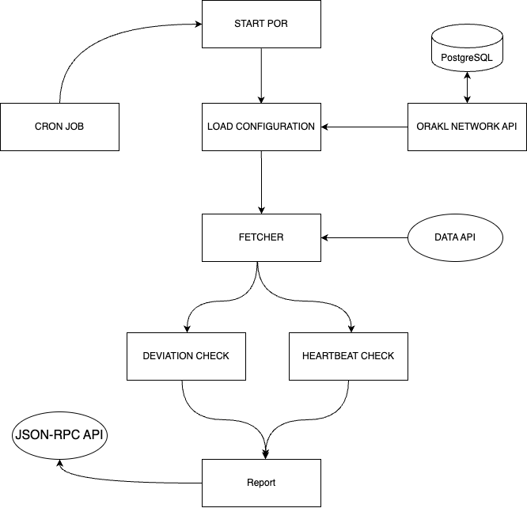

# Orakl Network Proof of Reserve

## Description

The **Orakl Network Proof of Reserve** is a critical component within the Orakl Network ecosystem, designed to establish and verify the reserve holdings of financial entities. This service ensures transparency and trust in the financial operations by providing a secure and auditable process for validating reserve data. The Orakl Network Proof of Reserve is a cornerstone within the ecosystem, dedicated to establishing trust in financial operations. This service seamlessly integrates off-chain and on-chain processes, providing a robust framework to verify and authenticate reserve holdings.


A Proof of Reserve is defined by a pair of an adapter and an aggregator, and can be accessed on-chain through a `AggregatorProxy` smart contract, where the on-chain implementation of contracts are reused from [Orakl Network Data Feed](./data-feed.md). The `AggregatorProxy` is an auxiliary contract that redirects read requests to `Aggregator` contract. The Proof of Reserve's `Aggregator` contract holds all submission values that is served to consumers through `AggregatorProxy` contract.

Every proof of reserve has configuration that describes the least frequent update interval called `heartbeat`, and minimum deviation threshold (`deviationTreshold`). 

The **Orakl Network Proof of Reserve** operates as a streamlined, single-process system, easily triggered by a Cron job. The initial phase involves retrieving the most recent `roundId` and `PoR value` from the Proof of Reserve `Aggregator contract`. Subsequently, the process assesses eligibility for submission through a combination of the `Heartbeat Check` and `Deviation Check`. If either condition is met, the final step involves fetching data from the `API resource` and reporting the next round to the `POR contract`. This cohesive workflow ensures efficient and timely execution of the `Proof of Reserve` process.


The code is located under [`core` directory](https://github.com/Bisonai/orakl/tree/master/core/src/por).

## Setup

The **Orakl Network Proof of Reserve** requires an access to configuration of adapter, aggregator and reporter.

### Reporter

The **Orakl Network API** holds information about all reporters. The command below adds a single Proof of Reserve reporter to the Orakl Network state to report to `oracleAddress`. The chain parameter specifies a chain on which we expect to operate. Reporter is defined by an `address` and a `privateKey` parameters.

```sh
orakl-cli reporter insert \
  --service POR \
  --chain ${chain} \
  --address  ${address} \
  --privateKey ${privateKey} \
  --oracleAddress ${oracleAddress}
```

### Adapter & Aggregator

```sh
orakl-cli adapter insert \
    --file-path ${adapterJsonFile}

orakl-cli aggregator insert \
    --chain ${chain} \
    --file-path ${aggregatorJsonFile}
```

## Configuration

Before we launch the **Orakl Network Proof of Reserve**, we must specify [several environment variables](https://github.com/Bisonai/orakl/blob/master/core/.env.example). The environment variables are automatically loaded from a `.env` file.

* `POR_AGGREGATOR_HASH`
* `NODE_ENV=production`
* `CHAIN`
* `PROVIDER_URL`
* `ORAKL_NETWORK_API_URL`
* `LOG_LEVEL`
* `HEALTH_CHECK_PORT`
* `SLACK_WEBHOOK_URL`

`POR_AGGREGATOR_HASH` first environment variable is to define aggregator hash value of the unique aggregator which will used for Proof of Reserve service.  

The **Orakl Network Proof of Reserve** is implemented in Node.js which uses `NODE_ENV` environment variable to signal the execution environment (e.g. `production`, `development`). [Setting the environment to `production`](https://nodejs.dev/en/learn/nodejs-the-difference-between-development-and-production/) generally ensures that logging is kept to a minimum, and more caching levels take place to optimize performance.

`CHAIN` environment variable specifies on which chain the **Orakl Network Proof of Reserve** will be running, and which resources will be collected from the **Orakl Network API**.

`PROVIDER_URL` defines an URL string representing a JSON-RPC endpoint that listener, worker, and reporter communicate through.

`ORAKL_NETWORK_API_URL` corresponds to url where the **Orakl Network API** is running. The **Orakl Network API** interface is used to access Orakl Network state such as listener, worker, and reporter configuration.

Setting a level of logs emitted by a running instance is set through `LOG_LEVEL` environment variable, and can be one of the following: `error`, `warning`, `info`, `debug` and `trace`, ordered from the most restrictive to the least. By selecting any of the available options you subscribe to the specified level and all levels with lower restrictiveness.

The **Orakl Network Proof of Reserve** does not offer a rich REST API, but defines a health check endpoint (`/`) served under a port denoted as `HEALTH_CHECK_PORT`.

Errors and warnings emitted by the **Orakl Network Proof of Reserve** can be [sent to Slack channels through a slack webhook](https://api.slack.com/messaging/webhooks). The webhook URL can be set with the `SLACK_WEBOOK_URL` environment variable.

## Launch

Before launching the Proof of Reserve solution, the **Orakl Network API** has to be accessible from the **Orakl Network Proof of Reserve** to load reporter and adapter-aggregator settings.

After the **Orakl Network API** is healthy, Proof of Reserve can be triggered by cron job.

```sh
yarn start:por
```

## Architecture

<figure><figcaption><p>Orakl Network Proof of Reserve</p></figcaption></figure>
