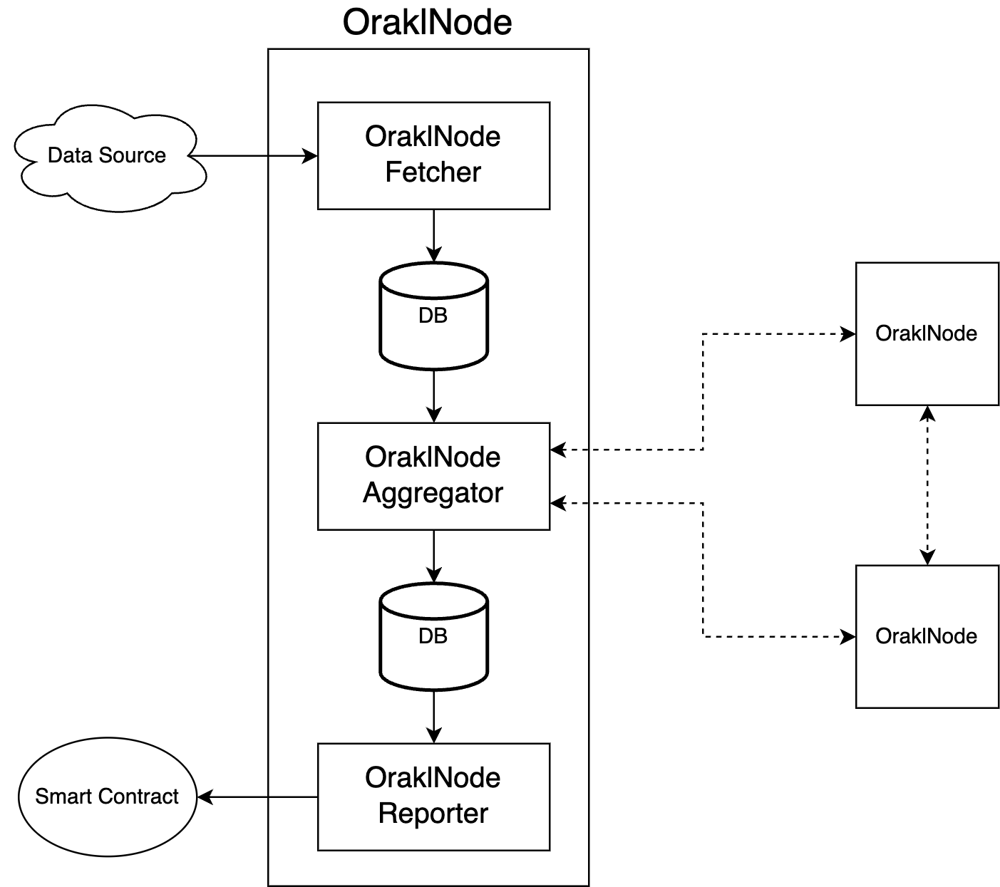

# Orakl Network Data Feed V2

## Description

**Orakl Network Data Feed**는 주요 Orakl Network 솔루션 중 하나입니다. **Orakl Network Data Feed**의 목표는 오프 체인에서 온 체인으로 빈번한 데이터 업데이트를 제공하는 것입니다. 데이터 피드는 확인된 노드 운영자가 보고한 가장 최신 값으로 구성된 제출 풀에서 생성됩니다.

단일 데이터 피드는 어댑터와 집계기의 쌍으로 정의되며, `FeedProxy` 스마트 계약을 통해 온 체인에서 액세스할 수 있습니다. `FeedProxy`는 읽기 요청을 `Feed` 계약으로 리디렉션하는 보조 계약입니다. `Feed` 계약에는 모든 노드 운영자로부터의 모든 제출과 `FeedProxy` 계약을 통해 소비자에게 제공되는 집계 값이 포함됩니다.

각 피드의 자세한 사양은 [orakl-config](https://github.com/Bisonai/orakl-config)의 `configs.json` 파일에서 찾을 수 있습니다. 모든 데이터 피드는 3가지 다른 간격으로 구성됩니다. `fetchInterval`, `aggregateInterval`, 그리고 `submitInterval`. 오프 체인 집계를 수행하는 새 데이터 피드를 나타내는 `OraklNode는` 정의된 간격을 기반으로 각 작업을 실행할 것입니다. 데이터 피드는 OraklNodes 사이에서 오프 체인으로 최종 값이 생성된 후에 업데이트됩니다. `address는` 특정 쌍의 값을 취하는 Feed 계약 주소를 나타냅니다. `feeds`에는 데이터 소스에서 값을 가져오고 구문 분석하는 정의가 포함되어 있습니다.

코드는 [`node` 디렉토리](https://github.com/Bisonai/orakl/tree/master/node)에 있으며, Modular Monolith 패턴을 따릅니다. 엔트리포인트는 `./node/cmd` 디렉토리에서 찾을 수 있으며, 구현 코드는 `./node/pkg` 디렉토리에서 찾을 수 있습니다.

## Launch

`./node` 디렉토리의 [README.md](https://github.com/Bisonai/orakl/blob/master/node/README.md)를 참조하십시오.

## Architecture

<figure><figcaption>
Orakl Network Data Feed (오프체인 집계)
</figcaption></figure>
