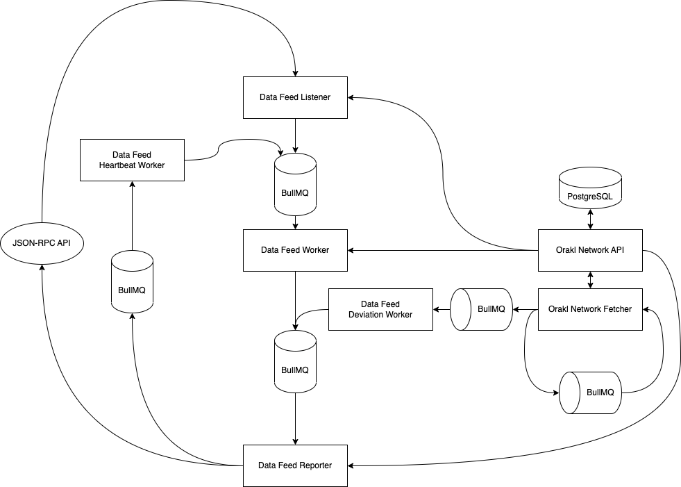

# Orakl Network Data Feed

## Description

**Orakl Network Data Feed** 는 Orakl Network의 주요 솔루션 중 하나입니다. **Orakl Network Data Feed** 의 목표는 오프체인에서 온체인으로의 빈번한 데이터 업데이트를 제공하는 것입니다. 데이터 피드는 검증된 노드 오퍼레이터들에 의해 보고된 가장 최신의 값들로 구성된 제출 풀에서 생성됩니다.

단일 데이터 피드는 adapter 와 aggregator의 쌍으로 정의되며, `AggregatorProxy` 스마트 계약을 통해 온체인에서 액세스할 수 있습니다. `AggregatorProxy` 는 읽기 요청을 `Aggregator` 계약으로 리디렉션하는 보조 계약입니다. `Aggregator` 계약은 모든 노드 오퍼레이터로부터의 모든 제출과 aggregated된 값을 보유하며, `AggregatorProxy` 계약을 통해 소비자에게 제공됩니다.

각 데이터 피드에는 `heartbeat`라고 불리는 최소 업데이트 간격, 최소 편차 임계값(`deviationTreshold`), 그리고 최소 절대 임계값 (`absoluteThreshold`)과 같은 구성이 있습니다. 데이터 피드는 라운드별로 업데이트되며, 이는 **Orakl Network Data Feed** 노드 오퍼레이터 중 하나에 의해 시작될 수 있습니다. 라운드가 시작되면, 모든 노드 오퍼레이터는 해당 데이터 피드에 대해 최신 관찰 값(submission)을 제출해야 합니다. T새로운 라운드를 시작하는 첫 번째 제출 트랜잭션은 `NewRound` 이벤트를 발생시키는데, 이 이벤트는 **Orakl Network Data Feed Listener** 마이크로서비스를 실행 중인 노드 오퍼레이터에 의해 포착됩니다. `NewRound` 이벤트에는 새로 시작된 라운드의 ID를 나타내는 `roundId` 값이 포함됩니다. **Orakl Network Data Feed Worker** 가 이미 동일한 ID의 라운드를 처리 중인 경우,리스너는 요청을 삭제합니다. 그렇지 않은 경우, 리스너는 요청을 워커에게 전달합니다. **Orakl Network Data Feed Worker** 에 도착하는 요청에는 라운드 ID에 대한 정보가 포함될 수도 있고 포함되지 않을 수도 있습니다.

- Worker 요청에 `roundId`가 포함된 경우, worker는 **Orakl Network API** 에 최신 데이터 피드 값을 조회하여 모든 관찰된 데이터 소스에서 집계된 값을 가져옵니다.
- Worker 요청에 `roundId`가 포함되지 않은 경우 (예: `heartbeat` , `deviationThreshold` 또는 `absoluteTreshold` 로 인한 요청), worker는 먼저 `Aggregator` 에 현재 열린 라운드가 있는지 확인하고, 추가로 **Orakl Network API** 를 통해 최신 데이터 피드 값을 가져옵니다.

Worker가 어떤 `roundId`에 대해 보고해야 하는지를 알고, 최신 데이터 피드 값의 aggregate에 접근한 후, 작업을 **Orakl Network Data Feed Reporter**에 전달합니다. Reporter는 worker로부터 받은 데이터를 포함하는 트랜잭션을 생성하고, `Aggregator` contract에 보고합니다. 마지막으로, Reporter는 `heartbeat` milliseconds 후에 자동으로 다음 라운드를 시작하기 위해 지연된 작업을 생성합니다.이전 데이터 피드에 대한 어떤 유휴상태의 지연된 작업이 있다면, 최신 작업으로 대체됩니다.

`편차 임계값(deviationThreshold)` 과 `절대 임계값(absoluteThreshold)` 은 **Orakl Network Fetcher**에서 실행되는 이벤트를 트리거합니다.

해당 코드는 [`core` 디렉토리](https://github.com/Bisonai/orakl/tree/master/core)에 위치하며, listener, worker, reporter 세 개의 독립적인 마이크로서비스로 분리되어 있습니다.

## State Setup

**Orakl Network Data Feed** 는 리스너(listener), 어댑터(adapter) 및 어그리게이터(aggregator)의 상태에 대한 접근이 필요합니다.

### Listener

**Orakl Network API** 는 모든 리스너에 대한 정보를 보유하고 있습니다. 아래 명령은 단일 Aggregator listener를 the Orakl Network 상태에 추가하여 `aggregatorAddress` 에서 `NewRound` 이벤트를 수신하도록 합니다. `chain`매개변수는 **Orakl Network Data Feed Listener**를 작동시킬 체인을 지정합니다.

```sh
orakl-cli listener insert \
    --service Aggregator \
    --chain ${chain} \
    --address ${aggregatorAddress} \
    --eventName NewRound
```

### Reporter

**Orakl Network API** 는 모든 리포터에 대한 정보를 보유하고 있습니다. 아래 command는 Orakl Network 상태에 단일 데이터 피드 리포터를 추가하여 `oracleAddress`에 보고합니다. Chain 매개변수는 운영을 기대하는 체인을 지정합니다. 리포터는 `address` 와 `privateKey` 매개변수로 정의됩니다.

```sh
orakl-cli reporter insert \
  --service DATA_FEED \
  --chain ${chain} \
  --address  ${address} \
  --privateKey ${privateKey} \
  --oracleAddress ${oracleAddress}
```

### Adapter & Aggregator

```sh
orakl-cli adapter insert \
    --file-path ${adapterJsonFile}

orakl-cli aggregator insert \
    --chain ${chain} \
    --file-path ${aggregatorJsonFile}
```

## Configuration

**Orakl Network Data Feed** 를 시작하기 전에[여러 환경 변수](https://github.com/Bisonai/orakl/blob/master/core/.env.example)를 지정해야 합니다. 환경 변수는 자동으로 `.env` 파일에서 로드됩니다.

- `NODE_ENV=production`
- `CHAIN`
- `PROVIDER_URL`
- `ORAKL_NETWORK_API_URL`
- `LOG_LEVEL`
- `LOG_DIR`
- `REDIS_HOST`&#x20;
- `REDIS_PORT`
- `HEALTH_CHECK_PORT`
- `HOST_SETTINGS_LOG_DIR`
- `SLACK_WEBHOOK_URL`

**Orakl Network Data Feed** 는 Node.js로 구현되어 있으며, 실행 환경을 나타내는 `NODE_ENV` 환경 변수를 사용합니다 (예: `production`, `development`). [환경을 `production` 으로 설정](https://nodejs.dev/en/learn/nodejs-the-difference-between-development-and-production/)하면 일반적으로 로깅이 최소화되고 성능을 최적화하기 위해 더 많은 캐싱 수준이 적용됩니다.

`CHAIN` 환경 변수는 **Orakl Network Data Feed** 가 실행될 체인을 지정하며, **Orakl Network API** 에서 수집할 리소스를 결정합니다.

`PROVIDER_URL`은 listener, worker, reporter 간에 통신하는 데 사용되는 JSON-RPC 엔드포인트를 나타내는 URL 문자열을 정의합니다.

`ORAKL_NETWORK_API_URL`은 **Orakl Network API** 가 실행 중인 URL을 나타냅니다. **Orakl Network API** 인터페이스는 listener, worker, reporter 구성과 같은 Orakl Network 상태에 액세스하는 데 사용됩니다.

실행 중인 인스턴스에서 발생하는 로그의 수준은 `LOG_LEVEL` 환경 변수를 통해 설정되며 다음 중 하나일 수 있습니다: `error`, `warning`, `info`, `debug` , `trace` 입니다. 이용 가능한 옵션 중 하나를 선택하면 해당 수준과 더 낮은 제한 수준의 모든 로그를 구독하게 됩니다.

로그들은 콘솔과 `LOG_DIR` 디렉토리에 있는 파일로 전송됩니다.

`REDIS_HOST` 와 `REDIS_PORT`는 **Orakl Network Data Feed** 마이크로서비스가 연결하는 [Redis](https://redis.io/)의 호스트와 포트를 나타냅니다. 기본값은 각각 `localhost` 와 `6379` 입니다.&#x20;

**Orakl Network VRF** 는 풍부한 REST API를 제공하지 않지만, `HEALTH_CHECK_PORT` 로 지정된 포트에서 제공되는 헬스 체크 엔드포인트 (`/`) 를 정의합니다.

`HOST_SETTINGS_LOG_DIR` 은 [Docker Compose 파일](https://github.com/Bisonai/orakl/blob/master/core/docker-compose.vrf.yaml)에서 사용되며, 수집된 로그 파일이 호스트에서 저장될 위치를 나타냅니다.

**Orakl Network Data VRF** 에서 발생하는 오류와 경고를 [Slack 웹훅을 통해 Slack 채널로 전송](https://api.slack.com/messaging/webhooks)할 수 있습니다. 웹훅 URL은 `SLACK_WEBOOK_URL` 환경 변수를 사용하여 설정할 수 있습니다.

## Launch

Data Feed 솔루션을 시작하기 전에 **Orakl Network API** 가 **Orakl Network Data Feed** 에서 액세스할 수 있어야 합니다. 이를 위해 listener 및 adapter-aggregator 설정을 로드해야 합니다.

**Orakl Network API** 가 정상적으로 동작하는 경우, Data Feed 마이크로서비스 (listener, worker, reporter)를 임의의 순서로 시작할 수 있습니다. 마이크로서비스는 BullMQ - job queue를 통해 서로 통신합니다.

```sh
yarn start:listener:aggregator
yarn start:worker:aggregator
yarn start:reporter:aggregator
```

## Architecture

<figure><figcaption><p>Orakl Network Data Feed</p></figcaption></figure>
