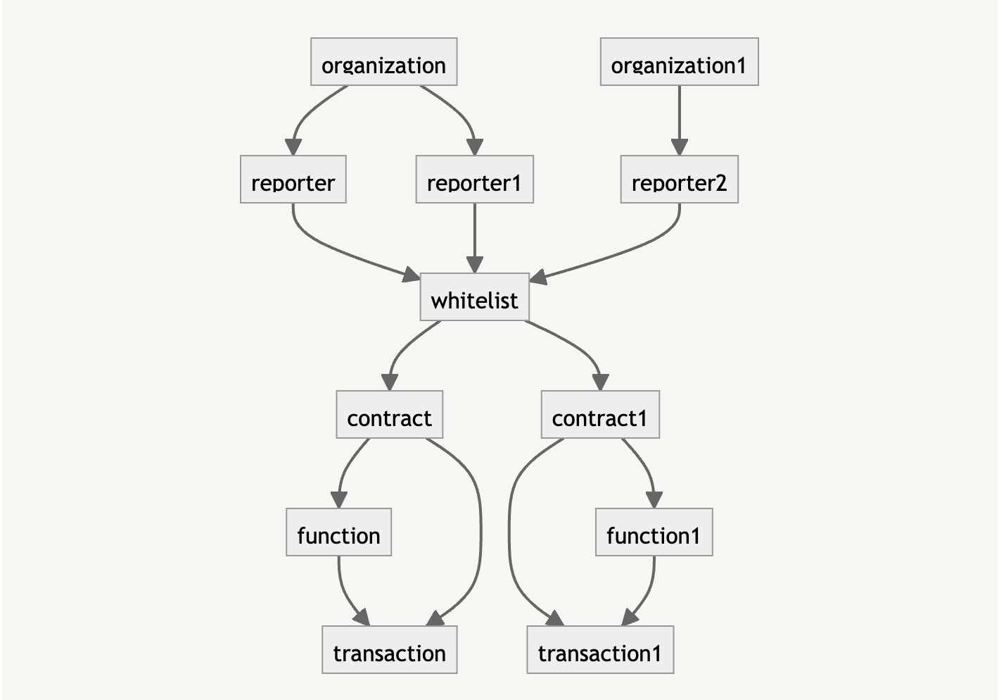

# Orakl Network Delegator

## Description

**Orakl Network Delegator** 사용자 정의 화이트리스트 규칙에 따라 들어오는 트랜잭션을 확인하고, 조건을 만족하는 경우 수수료 지불자로서 서명하는 [수수료 위임](https://docs.klaytn.foundation/content/klaytn/design/transactions/fee-delegation) 마이크로 서비스입니다. 해당 코드는 [`delegator` 디렉토리](https://github.com/Bisonai/orakl/tree/master/delegator)에 위치해 있습니다.

## API Endpoints

**Orakl Network Delegator** 는 **Orakl Network Reporter**의 등록된 EOA로부터 트랜잭션을 받아와 사용자 정의 화이트리스트 규칙에 따라 유효성을 검사한 후 수수료 지불자 계정으로 서명하는 역할을 합니다. **Orakl Network Delegator** 는 REST 웹 서버로 구현되어 있으며, 모든 트랜잭션 및 관련된 메타데이터는 PostgreSQL 데이터베이스에 저장됩니다.

### Sign Transaction

트랜잭션에 서명하기 위해서는 `api/v1/sign` 엔드포인트를 사용할 수 있습니다.

```shell
curl -X 'POST' \
  'http://localhost:3000/api/v1/sign' \
  -H 'accept: */*' \
  -H 'Content-Type: application/json' \
  -d '{
  "from": "string",
  "to": "string",
  "input": "string",
  "gas": "string",
  "value": "string",
  "chainId": "string",
  "gasPrice": "string",
  "nonce": "string",
  "v": "string",
  "r": "string",
  "s": "string",
  "rawTx": "string",
  "signedRawTx": "string"
}'
```

### Organization

첫 번째 단계는 organization 이름을 추가하는 것입니다.

새로운 organization 이름 추가를 위해 `api/v1/organization` 엔드포인트를 사용할 수 있습니다.

```shell
curl -X 'POST' \
  'http://localhost:3000/api/v1/organization' \
  -H 'accept: */*' \
  -H 'Content-Type: application/json' \
  -d '{
  "name": "Bisonai"
}'
```

### Reporter

다음 단계는 리포터 주소를 organization과 연결하는 것입니다.

새로운 리포터 추가를 위해 `api/v1/reporter` 엔드포인트를 사용할 수 있습니다.

```shell
curl -X 'POST' \
  'http://localhost:3000/api/reporter' \
  -H 'accept: */*' \
  -H 'Content-Type: application/json' \
  -d '{
  "address": "string",
  "organizationId": 0
}'
```

### Contract

리포터를 정의한 후에는 서비스의 계약 주소를 화이트리스트에 추가하는 것이 다음 단계입니다. 현재, [화이트리스트에는 함수 셀렉터도 포함](delegator.md#function-whitelist) 되어야 합니다.

새로운 계약 추가를 위해 `api/v1/contract` 엔드포인트를 사용할 수 있습니다.

```shell
curl -X 'POST' \
  'http://localhost:3000/api/v1/contract' \
  -H 'accept: */*' \
  -H 'Content-Type: application/json' \
  -d '{
  "address": "string"
}'
```

### Function

계약 주소를 추가한 후, 다음 단계는 특정 계약 주소 내에서 실행될 수 있는 함수 메소드를 정의하는 것입니다.

새로운 함수 이름 추가를 위해 `api/v1/function` 엔드포인트를 사용할 수 있습니다.

```shell
curl -X 'POST' \
  'http://localhost:3000/api/v1/function' \
  -H 'accept: */*' \
  -H 'Content-Type: application/json' \
  -d '{
  "name": "increment()",
  "contractId": 1,
  "encodedName": ""
}'
```

### Connect Reporter

마지막 단계는 리포터와 계약을 연결하는 것입니다.

새로운 화이트리스트 연결 추가를 위해 `api/v1/contract/connectReporter` 엔드포인트를 사용할 수 있습니다.

```shell
curl -X 'POST' \
  'http://localhost:3000/api/v1/contract/connectReporter' \
  -H 'accept: */*' \
  -H 'Content-Type: application/json' \
  -d '{
  "contractId": 0,
  "reporterId": 0
}'
```

## Configuration

**Orakl Network Delegator**를 시작하기 전에 [몇 가지 환경 변수](https://github.com/Bisonai/orakl/blob/master/delegator/.env.example)를 지정해야 합니다. 환경 변수는 `.env` 파일에서 자동으로 로드됩니다.

- `DATABASE_URL`
- `PROVIDER_URL`
- `APP_PORT`

`DATABASE_URL`은 **Orakl Network** 상태를 저장할 데이터베이스와의 [연결 문자열](https://www.postgresql.org/docs/current/libpq-connect.html#LIBPQ-CONNSTRING)을 나타냅니다.

> `DATABASE_URL`의 형식은 `postgresql://[userspec@][hostspec][/dbname][?paramspec]`입니다. 예시 문자열은 다음과 같을 수 있습니다: `postgresql://bisonai@localhost:5432/orakl?schema=public.`

`PROVIDER_URL` 은 listener, worker, 그리고 reporter가 통신하는 JSON-RPC 엔드포인트를 나타내는 URL 문자열을 정의합니다.

`APP_PORT` 는 **Orakl Network Delegator** 가 실행되는 포트를 나타냅니다. 다른 서비스에서 **Orakl Network Delegator** 에 연결할 때 이 포트가 필요합니다.

`DELEGATOR_FEEPAYER_PK` 는 모든 트랜잭션을 수수료 지불자로서 서명하는 대행자 계정의 개인 키입니다.

`DELEGATOR_REPORTER_PK` 는 **Orakl Network Reporter** 서비스 내에서 트랜잭션을 생성하는 리포터 계정의 개인 키입니다. 이 개인 키는 테스트에서만 사용됩니다.

## Launch

**Orakl Network Delegator** 를 시작하기 전에, 대행자의 개인 키를 `fee_payers` 테이블의 `privateKey` 열에 추가해야 합니다. 이 개인 키는 수수료 지불자로서 [위임된 수수료 트랜잭션](https://docs.klaytn.foundation/content/klaytn/design/transactions/fee-delegation)에 서명하는 데 사용됩니다.

제품 환경에서 소스 코드에서 Orakl Network Delegator를 시작하려면, 먼저 서비스를 빌드한 다음 시작하면 됩니다.

```sh
yarn build
yarn start:prod
```

Orakl Network Delegator 가 시작된 후에는 트랜잭션에 서명할 수 있도록 `privateKey`를 로드해야 합니다. `privateKey`는 `/api/v1/sign/initialize` 엔드포인트를 호출하여 로드할 수 있습니다.

## Architecture

<figure><figcaption><p>Orakl Network Delegator</p></figcaption></figure>
