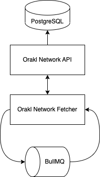

# Orakl Network Fetcher

## Description

Orakl Network Fetcher는 Data Feed 솔루션을 위한 보조 서비스로, 다양한 소스에서 최신 데이터를 수집합니다.&#x20;

해당 코드는 [`fetcher` 디렉토리](https://github.com/Bisonai/orakl/tree/master/fetcher)에 위치해 있습니다.

## State Setup

### Adapter & Aggregator

**Orakl Network Fetcher** 와 [**Orakl Network Data Feed**](data-feed.md)는 **adapter** 와 **aggregator** 추상화로 구성됩니다. **Orakl Network Fetcher** 가 수집한 모든 데이터 피드는 adapter-aggregator 쌍으로 정의되며, 이후 **Orakl Network Data Feed** 가 해당 데이터를 on-chain에 제출합니다. Adapter와 Aggregator는 JSON 형식으로 정의됩니다. 아래에 자세한 설명을 찾으실 수 있습니다.

**Adapter**는 데이터 소스(`feeds`)와 피드로부터 수신된 데이터에 적용되는 후 처리 규칙(`reducers`)의 집합입니다. 또한, 각 adapter에는 `이름` , `소수점 자리수(decimals)` 및 `어댑터 해시(adapterHash)` 가 있습니다. `decimals` 속성은 후 처리된 값이 인코딩된 소수점 자리수를 나타냅니다.
값 자체는`integer` 형식으로 저장되며 소수점은 별도로 저장됩니다. 마지막으로, `adapterHash` 는 `adapterHash` 자체를 제외한 모든 속성으로부터 계산됩니다. 이는 어댑터를 누구도 알아차리지 못하게 무단으로 수정되는 것을 방지하기 위해 안전상의 이유로 정의되었습니다.

```json
{
  "adapterHash": "0xe63985ed9d9aae887bdcfa03b53a1bea6fd1acc58b8cd51a9a69ede43eac6235",
  "name": "BTC-USD",
  "decimals": 8,
  "feeds": [
    {
      "name": "Binance-BTC-USD",
      "definition": {
        "url": "https://api.binance.us/api/v3/ticker/price?symbol=BTCUSD",
        "headers": {
          "Content-Type": "application/json"
        },
        "method": "GET",
        "reducers": [
          {
            "function": "PARSE",
            "args": ["price"]
          },
          {
            "function": "POW10",
            "args": 8
          },
          {
            "function": "ROUND"
          }
        ]
      }
    }
  ]
}
```

**aggregator** 는 온체인 메타데이터 (`address`), 오프체인 메타데이터 (`name`, `heartbeat`, `threshold`, `absoluteThreshold`), 및 어댑터에 대한 연결 (`adapterHash`)로 설명됩니다. address는 `adapterHash`로 식별되는 데이터 피드에 대해 화이트리스트 된 노드 오퍼레이터로부터 제출을 받는 배포된 스마트 계약 `Aggregator`에 해당합니다. `name`은 aggregator에 대한 설명을 제공합니다. `heartbeat`는 `Aggregator` 스마트 계약의 가장 낮은 업데이트 주기를 정의합니다 (값은 밀리초로 표시됩니다). `threshold` 는 데이터 피드에서의 최소 요구 값 편차를 나타냅니다 (예: 0.05는 ±5 % 편차를 의미함). 데이터 피드의 가능한 값 범위가 0에서 ∞일 때, `absoluteThreshold` 는 데이터 피드 값이 0이 된 후 데이터 피드를 다시 업데이트하기 시작하기 전에 관찰되어야 하는 최소 절대 변경을 정의하는 데 사용됩니다. `adapterHash` aggregator와 adapter 간의 단항 관계를 나타냅니다.

```json
{
  "aggregatorHash": "0xfda8c08a8b7641e001ad23c0fb363a9e7aab1e3a7eb8a6ddee41deeb7e3ef279",
  "name": "BTC-USD",
  "address": "0x15c0b3ea93ed4de0a1f93f4ae130aefd8f2e8ccb",
  "heartbeat": 15000,
  "threshold": 0.05,
  "absoluteThreshold": 0.1,
  "adapterHash": "0xe63985ed9d9aae887bdcfa03b53a1bea6fd1acc58b8cd51a9a69ede43eac6235"
}
```

### Add Adapter & Aggregator

만약 Orakl Network 상태에 adapter와 aggregator가 없다면, **Orakl Network CLI** 통해 생성할 수 있습니다. To find out, Orakl Network 상태에 adapter와 aggregator가 있는지 확인하려면 아래의 command를 실행하면 됩니다.

```
orakl-cli adapter list
orakl-cli aggregator list
```

Agregator는 `chain`과 관련되어 있으므로, 아직 **Orakl Network API** 를 통해 어떠한 체인도 정의하지 않았다면, aggregator를 추가하기 전에 체인을 먼저 정의해야 합니다.

```sh
orakl-cli chain insert --name localhost
```

아래 코드 목록에는 `localhost` 체인에 adapter와 aggregator를 추가하는 예제가 나와 있습니다. Adapter 와 aggregator JSON 파일의 `adapterHash`가 동일해야 됨에 유의해주세요.그렇지 않으면 둘을 연결할 수 없습니다. 등록되지 않은 `adapterHash`로 aggregator를 추가하려고 하면 작업이 중단됩니다.

```sh
orakl-cli adapter insert \
    --file-path [path/to/adapter.json]

orakl-cli aggregator insert \
    --file-path [path/to/aggregator.json] \
    --chain localhost
```

### Activate Aggregator

Adapter 와 aggregator가 Orakl Network 상태에 등록되면 처음에는 비활성화 상태가 됩니다. 데이터 수집에 사용하려면 활성화해야 합니다. 활성화는 **Orakl Network CLI** 를 통해 수행할 수 있습니다.

```sh
orakl-cli fetcher start \
    --id ${aggregatorhash} \
    --chain ${chainName}
```

### Deactivate Aggregator

Adapter-aggregator 쌍으로 정의된 데이터 수집은 적절한 `aggregatorHash` 와 함께 아래 명령을 실행함으로써 언제든지 중지할 수 있습니다.

```sh
orakl-cli fetcher stop \
    --id ${aggregatorHash} \
    --chain ${chainName}
```

## Configuration

**Orakl Network Fetcher** 를 시작하기 전에 [여러 환경 변수](https://github.com/Bisonai/orakl/blob/master/fetcher/.env.example)를 지정해야 합니다.환경 변수는 자동으로 `.env` 파일에서 로드됩니다.

- `REDIS_HOST`
- `REDIS_PORT`
- `ORAKL_NETWORK_API_URL`
- `APP_PORT`

`REDIS_HOST` 와 `REDIS_PORT`는 **Orakl Network Fetcher** 가 연결하는 [Redis](https://redis.io/)의 호스트와 포트를 나타냅니다. 기본 값은 각각 `localhost`와 `6379`입니다. Redis는 [BullMQ](https://docs.bullmq.io/)를 통해 정기적으로 미리 정의된 간격으로 데이터를 수집하는 데 사용됩니다.&#x20;

`ORAKL_NETWORK_API_URL`은 **Orakl Network API** 가 실행 중인 URL에 해당합니다. **Orakl Network Fetcher** 가 수집하고 집계한 데이터는 **Orakl Network API** 인터페이스를 통해 [PostgreSQL](https://www.postgresql.org/)로 전송됩니다.

`APP_PORT`는 **Orakl Network Fetcher** 가 실행될 포트를 나타냅니다. 이 포트는 다른 서비스(예: **Orakl Network CLI**) 에서 **Orakl Network API**에 연결할 때 필요합니다.

## Launch

**Orakl Network Fetcher** 를 프로덕션 환경에서 소스 코드로 실행하려면 먼저 서비스를 빌드해야 하며, 그 후에 실행할 수 있습니다.

```sh
yarn build
yarn start:prod
```

**Orakl Network Fetcher** 가 시작되면, 모든 활성화된 aggregator는 다음과 같은 작업을 수행합니다:

- 활성화된 aggregator 어댑터 피드에 정의된 각 데이터 소스에서 데이터를 수집합니다.
- 수집된 데이터를 계산하여 집계 결과를 저장합니다.

수집된 데이터와 계산된 데이터는 **Orakl Network API** 를 통해 PostgreSQL로 전송됩니다. **Orakl Network Fetcher** 가 실행중일 때 aggregators를 [활성화](orakl-network-fetcher.md#activate-aggregator) 하거나 [비활성화](orakl-network-fetcher.md#deactivate-aggregator)할 수 있습니다.

## Architecture

<figure><figcaption><p>Orakl Network Fetcher</p></figcaption></figure>
