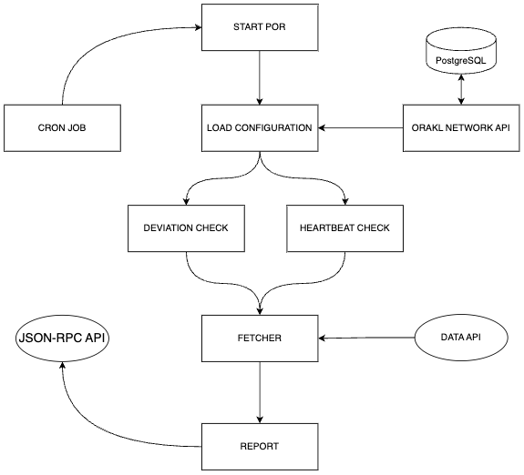

# Orakl Network Proof of Reserve

## Description

**Orakl Network Proof of Reserve** 는 금융 기관의 예비 자산을 확립하고 확인하기 위해 설계된 Orakl Network 생태계 내에서 중요한 구성 요소입니다. 이 서비스는 예비 데이터를 확인하기 위한 안전하고 감사 가능한 프로세스를 제공하여 금융 작업에 대한 투명성과 신뢰를 보장합니다. Orakl Network Proof of Reserve은 금융 작업에 대한 신뢰를 확립하기 위해 헌신된 생태계 내의 중심 역할을 합니다. 이 서비스는 오프체인 및 온체인 프로세스를 원활하게 통합하여 예비 자산을 확인하고 인증하기 위한 견고한 프레임워크를 제공합니다.

준비금 증명(Proof of Reserve)은 어댑터와 어그리게이터의 쌍에 의해 정의되며, [Orakl Network Data Feed](./data-feed.md) 에서 재사용된 온체인 계약 구현을 통해 온체인에서 액세스할 수 있습니다. `AggregatorProxy` 는 읽기 요청을 `Aggregator` 계약으로 리디렉션하는 보조 계약입니다. The Proof of Reserve의 `Aggregator` 계약은 모든 제출 값들을 보유하며 이 값들은 `AggregatorProxy` 계약을 통해 소비자에게 제공됩니다.

모든 준비금 증명에는 `heartbeat`(가장 적은 업데이트 간격)과 (`deviationTreshold`)(최소 편차 임곗값)을 설명하는 구성이 있습니다."

**Orakl Network Proof of Reserve** 는 간소화된 단일 프로세스 시스템으로 작동하며 크론 작업에 의해 쉽게 트리거됩니다. 초기 단계는 Proof of Reserve `Aggregator contract` 계약에서 가장 최근의 `roundId` 와 `PoR value` 를 검색하는 것입니다. 그 다음 프로세스는 `Heartbeat Check` 및 `Deviation Check` 의 조합을 통해 제출 대상 여부를 평가합니다. 어떤 조건이라도 충족되면 최종 단계는 `API resource` 에서 데이터를 가져와 다음 라운드를 `POR contract`에 보고하는 것입니다. 이 통합된 워크플로우는 `Proof of Reserve` 프로세스의 효율적이고 시기적절한 실행을 보장합니다.

해당 코드는 [`core` 디렉터리](https://github.com/Bisonai/orakl/tree/master/core/src/por) 에 위치해 있습니다.

## Setup

**Orakl Network Proof of Reserve** 는 어댑터, 어그리게이터 및 리포터의 구성에 대한 액세스가 필요합니다.

### Reporter

**Orakl Network API** 는 모든 리포터에 대한 정보를 보유하고 있습니다. 아래 명령은 Orakl Network 상태에 하나의 Proof of Reserve 리포터를 추가하여 `oracleAddress`로 보고합니다. chain 매개변수는 우리가 작동을 기대하는 체인을 지정합니다. 리포터는 `address` 및 `privateKey` 매개변수로 정의됩니다.

```sh
orakl-cli reporter insert \
  --service POR \
  --chain ${chain} \
  --address  ${address} \
  --privateKey ${privateKey} \
  --oracleAddress ${oracleAddress}
```

### Adapter & Aggregator

```sh
orakl-cli adapter insert \
    --file-path ${adapterJsonFile}

orakl-cli aggregator insert \
    --chain ${chain} \
    --file-path ${aggregatorJsonFile}
```

## Configuration

**Orakl Network Proof of Reserve**를 시작하기 전에 [여러 환경 변수](https://github.com/Bisonai/orakl/blob/master/core/.env.example)를 지정해야 합니다. 환경 변수는 자동으로 .env 파일에서 로드됩니다.

- `POR_AGGREGATOR_HASH`
- `NODE_ENV=production`
- `CHAIN`
- `PROVIDER_URL`
- `ORAKL_NETWORK_API_URL`
- `LOG_LEVEL`
- `HEALTH_CHECK_PORT`
- `SLACK_WEBHOOK_URL`

첫 번째 환경 변수인 `POR_AGGREGATOR_HASH`는 Proof of Reserve 서비스에 사용될 고유 어그리게이터의 해시 값을 정의합니다.

**Orakl Network Proof of Reserve** 는 Node.js로 구현되어 있으며, `NODE_ENV` 환경 변수를 사용하여 실행 환경을 신호로 보냅니다 (예: `production`, `development`). [환경을 `production`으로 설정](https://nodejs.org/en/learn/getting-started/nodejs-the-difference-between-development-and-production) 하면 일반적으로 로깅이 최소화되며 성능을 최적화하기 위해 더 많은 캐싱 수준이 사용됩니다.

`CHAIN` 환경 변수는 **Orakl Network Proof of Reserve** 가 실행될 체인 및 **Orakl Network API** 에서 수집할 리소스를 지정합니다.

`PROVIDER_URL` 은 리스너, 워커 및 리포터가 통신하는 JSON-RPC 엔드포인트를 나타내는 URL 문자열을 정의합니다.

`ORAKL_NETWORK_API_URL` 은 **Orakl Network API** 가 실행 중인 URL을 나타냅니다. **Orakl Network API** 인터페이스는 리스너, 워커 및 리포터 구성과 같은 Orakl Network 상태에 액세스하는 데 사용됩니다.

실행 중인 인스턴스에서 생성된 로그의 수준은 `LOG_LEVEL` 환경 변수를 통해 설정되며 다음 중 하나일 수 있습니다: `error`, `warning`, `info`, `debug` 및 `trace`. 가장 제한적인 것부터 가장 덜 제한적인 것까지 순서대로 나열되었습니다. 사용 가능한 옵션 중 하나를 선택하면 해당 수준 및 제한이 더 낮은 모든 수준을 구독합니다.

**Orakl Network Proof of Reserve** 는 풍부한 REST API를 제공하지 않지만 (`/`) 에서 제공되는 health check 엔드포인트를 정의합니다. 이 엔드포인트는 `HEALTH_CHECK_PORT`로 표시된 포트에서 제공됩니다.

**Orakl Network Proof of Reserve** 에서 생성된 오류 및 경고는 [slack webhook을 통해 Slack 채널로 전송](https://api.slack.com/messaging/webhooks) 할 수 있습니다. Webhook URL 은 `SLACK_WEBOOK_URL` 환경 변수로 설정할 수 있습니다.

## Launch

Proof of Reserve 솔루션을 시작하기 전에 **Orakl Network API** 는 리포터 및 어댑터-어그리게이터 설정을 로드하기 위해 **Orakl Network Proof of Reserve** 에서 접근 가능해야 합니다.

**Orakl Network API** 가 정상적으로 작동하는 상태라면 Proof of Reserve는 크론 작업에 의해 트리거될 수 있습니다.

```sh
yarn start:por
```

## Architecture

<figure><figcaption><p>Orakl Network Proof of Reserve</p></figcaption></figure>
