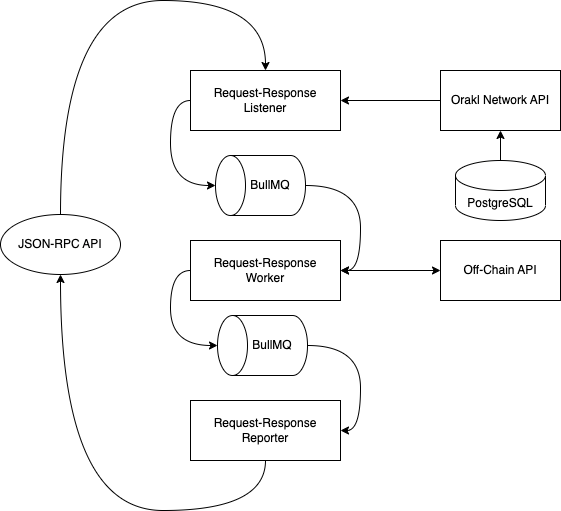

# Orakl Network Request-Response

## Description

**Orakl Network Request-Response** 는 Orakl Network의 주요 솔루션 중 하나입니다. 이는 온체인 스마트 계약에서 오프체인 데이터에 접근할 수 있도록 제공합니다. 요청은 온체인 이벤트를 통해 발생되며, **Orakl Network Request-Response Listener** 리스너에 의해 포착되고, **Orakl Network Request-Response Worker** 에 의해 처리되며, 최종적으로 **Orakl Network Request-Response Reporter** 를 통해 온체인으로 응답이 전송됩니다.

Orakl Network Request-Response의 코드는 [`core` 디렉토리](https://github.com/Bisonai/orakl/tree/master/core)에 위치해 있으며, 리스너(listener), 워커(worker), 리포터(reporter)로 세 가지 독립적인 마이크로서비스로 분리되어 있습니다.

## State Setup

**Orakl Network 의 Request-Response** 는 리스너와 리포터를 위해 상태에 대한 접근이 필요합니다.

### Listener

**Orakl Network API**는 모든 리스너에 대한 정보를 보유합니다. 아래 command를 사용하여 Orakl Network 상태에 단일 Request-Response 리스너를 추가하여 `DataRequested` 이벤트를 `requestResponseCoordinatorAddress` 에서 수신하도록 설정합니다. `chain` 매개변수는 **Orakl Network Request-Response Listener** 가 작동할 체인을 지정합니다.

```sh
orakl-cli listener insert \
    --service REQUEST_RESPONSE \
    --chain ${chain} \
    --address ${requestResponseCoordinatorAddress} \
    --eventName DataRequested
```

### Reporter

**Orakl Network API** 는 모든 리포터에 대한 정보를 보유하고 있습니다. 아래 command는 Orakl Network 상태에 단일 Request-Response 리포터를 추가하여 `oracleAddress`에 보고합니다. Chain 매개변수는 운영을 기대하는 체인을 지정합니다. 리포터는 `address` 와 `privateKey` 매개변수로 정의됩니다.

```sh
orakl-cli reporter insert \
  --service REQUEST_RESPONSE \
  --chain ${chain} \
  --address  ${address} \
  --privateKey ${privateKey} \
  --oracleAddress ${oracleAddress}
```

## Configuration

**Orakl Network Request-Response** 를 시작하기 전에 [여러 환경 변수](https://github.com/Bisonai/orakl/blob/master/core/.env.example)를 지정해야 합니다. 환경 변수는 자동으로 `.env` 파일에서 로드됩니다.

- `NODE_ENV=production`&#x20;
- `CHAIN`&#x20;
- `PROVIDER_URL`
- `ORAKL_NETWORK_API_URL`
- `LOG_LEVEL`
- `REDIS_HOST`
- `REDIS_PORT`
- `HEALTH_CHECK_PORT`
- `SLACK_WEBHOOK_URL`

**Orakl Network Request-Response** 는 Node.js로 구현되어 있으며, 실행 환경을 나타내는 `NODE_ENV` 환경 변수를 사용합니다 (예: `production`, `development`). [환경을 `production` 으로 설정](https://nodejs.org/en/learn/getting-started/nodejs-the-difference-between-development-and-production)하면 일반적으로 로깅이 최소화되고 성능을 최적화하기 위해 더 많은 캐싱 수준이 적용됩니다.

`CHAIN` 환경 변수는 **Orakl Network Request-Response** 가 실행될 체인을 지정하며, **Orakl Network API** 에서 수집할 리소스를 결정합니다.

`ORAKL_NETWORK_API_URL` 은 **Orakl Network API** 가 실행 중인 URL을 나타냅니다. **Orakl Network API** 인터페이스는 리스너 구성과 같은 Orakl Network 상태에 액세스하는 데 사용됩니다.

`PUBLIC_KEY` 와 `PRIVATE_KEY` 환경 변수는 reporter가 수신된 요청을 처리하는 데 필요합니다.

실행 중인 인스턴스에서 발생하는 로그의 수준은 `LOG_LEVEL` 환경 변수를 통해 설정되며 다음 중 하나일 수 있습니다: `error`, `warning`, `info`, `debug` 또는 `trace` 입니다. 가장 제한적인 것부터 가장 제한적이지 않은 것까지 순서대로 정렬되어 있습니다. 이용 가능한 옵션 중 하나를 선택하면 해당 수준과 더 낮은 제한 수준의 모든 로그를 구독하게 됩니다.

`REDIS_HOST` 와 `REDIS_PORT`는 **Orakl Network Request-Response** 마이크로서비스가 연결하는 [Redis](https://redis.io/)의 호스트와 포트를 나타냅니다. 기본값은 각각 `localhost` 와 `6379` 입니다.&#x20;

**Orakl Network Request-Response** 는 풍부한 REST API를 제공하지 않지만, `HEALTH_CHECK_PORT` 로 지정된 포트에서 제공되는 헬스 체크 엔드포인트 (`/`) 를 정의합니다.

**Orakl Network Request-Response** 에서 발생하는 오류와 경고를 [Slack 웹훅을 통해 Slack 채널로 전송](https://api.slack.com/messaging/webhooks)할 수 있습니다. 웹훅 URL은 `SLACK_WEBOOK_URL` 환경 변수를 사용하여 설정할 수 있습니다.

## Launch

Request-Response 솔루션을 시작하기 전에 **Orakl Network API** 는 **Orakl Network Request-Response** 에서 액세스하여 리스너 설정을 로드할 수 있어야 합니다.

**Orakl Network API** 가 정상적으로 동작하는 경우, Request-Response 마이크로서비스 (listener, worker, reporter)를 임의의 순서로 시작할 수 있습니다. 마이크로서비스는 BullMQ - job queue를 통해 서로 통신합니다.

```sh
yarn start:listener:request_response
yarn start:worker:request_response
yarn start:reporter:request_response
```

## Architecture

아키텍처는 **Orakl Network VRF** 와 매우 유사합니다. 유일한 차이점은 **Orakl Network Request-Response Worker** 가 온체인 요청을 기반으로 데이터를 가져와 처리한다는 점입니다.

<figure><figcaption><p>Orakl Network Request-Response</p></figcaption></figure>
