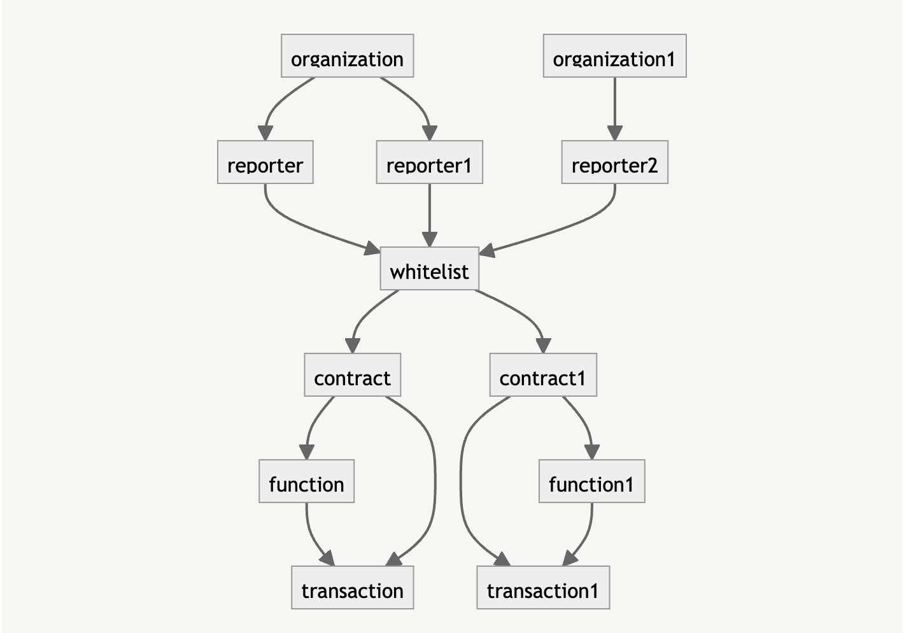

# Orakl Network Delegator

## Description

The **Orakl Network Delegator** is a [fee delegation](https://docs.klaytn.foundation/content/klaytn/design/transactions/fee-delegation) micro-service that verify incoming transaction based on customized whitelist rules, and sign them as a fee payer when they are eligible. The code is located under [`delegator` directory](https://github.com/Bisonai/orakl/tree/master/delegator).

## API Endpoints

The **Orakl Network Delegator** accepts transactions from registered EOAs of the **Orakl Network Reporter**, validates them based on customized whitelist rules, and finally signs them with a fee payer account. The **Orakl Network Delegator** is implemented as a REST web server, and all the transactions and related metadata are stored in the PostgreSQL database.

### Sign Transaction

To sign the transaction you can use `api/v1/sign` endpoint.

```shell
curl -X 'POST' \
  'http://localhost:3000/api/v1/sign' \
  -H 'accept: */*' \
  -H 'Content-Type: application/json' \
  -d '{
  "from": "string",
  "to": "string",
  "input": "string",
  "gas": "string",
  "value": "string",
  "chainId": "string",
  "gasPrice": "string",
  "nonce": "string",
  "v": "string",
  "r": "string",
  "s": "string",
  "rawTx": "string",
  "signedRawTx": "string"
}'
```

### Organization

The first step is to add an organization name.

To add a new organization name, you can use `api/v1/organization` endpoint.

```shell
curl -X 'POST' \
  'http://localhost:3000/api/v1/organization' \
  -H 'accept: */*' \
  -H 'Content-Type: application/json' \
  -d '{
  "name": "Bisonai"
}'
```

### Reporter

Next step is to connect a reporter address with organization.

To add a new reporter, you can use `api/v1/reporter` endpoint.

```shell
curl -X 'POST' \
  'http://localhost:3000/api/reporter' \
  -H 'accept: */*' \
  -H 'Content-Type: application/json' \
  -d '{
  "address": "string",
  "organizationId": 0
}'
```

### Contract

After defining teporter, the next step is to add a contract address of the service to the whitelist. Currently, [whitelist has to include function selector](delegator.md#function-whitelist) as well.

To add a new contract, you can use `api/v1/contract` endpoint.

```shell
curl -X 'POST' \
  'http://localhost:3000/api/v1/contract' \
  -H 'accept: */*' \
  -H 'Content-Type: application/json' \
  -d '{
  "address": "string"
}'
```

### Function

After adding the contract address, the next step is to define which function methods are allowed to be executed inside of specific contract address.

To add a new function name, you can use `api/v1/function` endpoint.

```shell
curl -X 'POST' \
  'http://localhost:3000/api/v1/function' \
  -H 'accept: */*' \
  -H 'Content-Type: application/json' \
  -d '{
  "name": "increment()",
  "contractId": 1,
  "encodedName": ""
}'
```

### Connect Reporter

The last step is to connect reporter with contract.

To add a new whitelist connection, you can use `api/v1/contract/connectReporter` endpoint.

```shell
curl -X 'POST' \
  'http://localhost:3000/api/v1/contract/connectReporter' \
  -H 'accept: */*' \
  -H 'Content-Type: application/json' \
  -d '{
  "contractId": 0,
  "reporterId": 0
}'
```

## Configuration

Before we launch the **Orakl Network Delegator**, we must specify [few environment variables](https://github.com/Bisonai/orakl/blob/master/delegator/.env.example). The environment variables are automatically loaded from an `.env` file.

* `DATABASE_URL`
* `PROVIDER_URL`
* `APP_PORT`

`DATABASE_URL` represents a [connection string](https://www.postgresql.org/docs/current/libpq-connect.html#LIBPQ-CONNSTRING) to a database that will hold the **Orakl Network** state.

> The format of `DATABASE_URL` should be `postgresql://[userspec@][hostspec][/dbname][?paramspec]`. An example string can look as follows `postgresql://bisonai@localhost:5432/orakl?schema=public.`

`PROVIDER_URL` defines an URL string representing a JSON-RPC endpoint that listener, worker, and reporter communicate through.

`APP_PORT` represents a port on which the **Orakl Network Delegator** will be running. This port will be necessary when we connect to **Orakl Network Delegator** from other services.

`DELEGATOR_FEEPAYER_PK` is the private key of delegator account which signs all transactions as a fee payer.

`DELEGATOR_REPORTER_PK` is the private key of reporter account makes transactions within the **Orakl Network Reporter** service. This private key is used only in tests.

## Launch

Before launching the **Orakl Network Delegator**, one must add delegator's private key to `privateKey` column inside of `fee_payers` table. This private key will be used to sign [delegated fee transactions](https://docs.klaytn.foundation/content/klaytn/design/transactions/fee-delegation) as a fee payer.

To launch the Orakl Network Delegator from source code in the production, first build the service, and then launch it.

```sh
yarn build
yarn start:prod
```

Once the Orakl Network Delegator is launched, we must load the `privateKey` to be able able to sign transactions. `privateKey` can be loaded by calling `/api/v1/sign/initialize` endpoint.

## Architecture

<figure><figcaption><p>Orakl Network Delegator</p></figcaption></figure>
