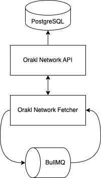

# Introduction

The Orakl Network is a service composed of [hybrid smart contracts](https://blog.chain.link/hybrid-smart-contracts-explained/) utilizing both on-chain and off-chain computation and computation in order to deliver following solutions:

* [Verifiable Random Function (VRF)](../developers-guide/verifiable-random-function-vrf.md)
* [Request-Response](../developers-guide/request-response.md)
* [Data Feed](../developers-guide/data-feed.md)

## On-Chain Orakl Network

On-chain implementation is located under [`contracts` directory](https://github.com/Bisonai/orakl/tree/master/contracts) with all relevant smart contracts, their tests, and deployment scripts. Node operators do not have to be concerned with the content of the `contracts` directory, but they need to know about the up-to-date smart contract addresses and their latests settings in order to setup their nodes properly. In cases, where node operator needs to know more details, we are going to explain all necessary information.

## Off-Chain Orakl Network

Off-chain part is split to several auxiliary micro services, and the main oracle solution:

* [Orakl Network API](introduction.md#orakl-network-api)
* [Orakl Network CLI](introduction.md#orakl-network-cli)
* [Orakl Network Fetcher](introduction.md#orakl-network-fetcher)
* [Orakl Network Delegator](introduction.md#orakl-network-delegator)
* [Orakl Network VRF](introduction.md#orakl-network-vrf)
* [Orakl Network Request-Response](introduction.md#orakl-network-request-response)
* [Orakl Network Aggregator](introduction.md#orakl-network-aggregator)

### Orakl Network API

The Orakl Network API is an abstraction layer representing a single source of truth for Orakl Network deployment. The code is located under [`api` directory](https://github.com/Bisonai/orakl/tree/master/api).&#x20;

The Orakl Network API has to be reachable from every Orakl Network service, and accessible to the [Orakl Network CLI](introduction.md#orakl-network-cli). It is implemented as a REST web server that accept requests from other services, and the state of the Orakl Network is stored in PostgreSQL database. The Orakl Network API has to be launched and configured before any other microservice.

#### Configuration

Before we launch the Orakl Network API, we must specify [few environment variables](https://github.com/Bisonai/orakl/blob/master/api/.env.example):

* `DATABASE_URL`
* `APP_PORT`

`DATABASE_URL` represents a [connection string](https://www.postgresql.org/docs/current/libpq-connect.html#LIBPQ-CONNSTRING) to a database that will hold the Orakl Network state.

> The format of `DATABASE_URL` should be `postgresql://[userspec@][hostspec][/dbname][?paramspec]`. An example string can look as follows `postgresql://bisonai@localhost:5432/orakl?schema=public.`&#x20;

`APP_PORT` represents a port on which the Orakl Network API will be running. This port will be necessary when we connect to Orakl Network API from other services.

#### Architecture

<figure><figcaption><p>Orakl Network API</p></figcaption></figure>

### Orakl Network CLI

The Orakl Network CLI is a tool to configure and manage Orakl Network. The Orakl Network allows us to read and modify the state of Orakl Network, therefore it is very important tool for node operator. The code is located under [`cli` directory](../developers-guide/data-feed.md).


To learn more about the Orakl Network CLI, start with the [Introduction page of Orakl Network CLI section](broken-reference).

### Orakl Network Fetcher

The Orakl Network Fetcher is an auxiliary service for Data Feed solution to collect the most up-to-date data from various sources.&#x20;

The code is located under `fetcher` directory.

#### Configuration

Before we launch the Orakl Network Fetcher, we must specify [several environment variables](https://github.com/Bisonai/orakl/blob/master/fetcher/.env.example):

* `REDIS_HOST`
* `REDIS_PORT`
* `ORAKL_NETWORK_API_URL`
* `APP_PORT`

`REDIS_HOST` and `REDIS_PORT` represent host and port of Redis to which the Orakl Network Fetcher connect to. The default values are `localhost` and `6379`, respectively. Redis is used indirectly through [BullMQ](https://docs.bullmq.io/) to collect data in regular predefined intervals.&#x20;

`ORAKL_NETWORK_API_URL` corresponds to url where the Orakl Network API is running. Collected and aggregated data by the Orakl Network Fetcher will be send to PostgreSQL through the Orakl Network API interface.

`APP_PORT` represents a port on which the Orakl Network Fetcher will be running. This port will be necessary when we connect to Orakl Network API from other services (e.g. Orakl Network CLI).

#### Adapter & Aggregator

The **Orakl Network Fetcher** and the [**Orakl Network Aggregator**](introduction.md#orakl-network-aggregator) are configured with **adapter** and **aggregator** abstractions. Every data feed collected by the **Orakl Network Fetcher** and then submitted to on-chain by the **Orakl Network Aggregator** is defined with an adapter-aggregator pair. Adapters and aggregators are defined in JSON format. You can find a detailed description of them below.

An **adapter** is a set of data sources (`feeds`) and post-processing rules (`reducers`) that are applied on data received from `feeds`. Additionally, every adapter has a `name`, `decimals` and an `adapterHash`. `decimals` property represents a number of decimal points in which the post processed values are  encoded. The values itself are in an `integer` format and decimal points are stored separately. Lastly, `adapterHash` is computed from all properties of adapter except the `adapterHash` itself. It was defined for safety reasons so nobody can accidentally modify the adapter without anybody noticing.

```json
{
  "adapterHash": "0xe63985ed9d9aae887bdcfa03b53a1bea6fd1acc58b8cd51a9a69ede43eac6235",
  "name": "BTC-USD",
  "decimals": 8,
  "feeds": [
    {
      "name": "Binance-BTC-USD",
      "definition": {
        "url": "https://api.binance.us/api/v3/ticker/price?symbol=BTCUSD",
        "headers": {
          "Content-Type": "application/json"
        },
        "method": "GET",
        "reducers": [
          {
            "function": "PARSE",
            "args": [
              "price"
            ]
          },
          {
            "function": "POW10",
            "args": 8
          },
          {
            "function": "ROUND"
          }
        ]
      }
    }
  ]
}
```

An **aggregator** is described with on-chain metadata (`address`), off-chain metadata (`name`, `heartbeat`, `threshold`, `absoluteThreshold`), and connection to an adapter (`adapterHash`). `address` corresponds to deployed smart contract `Aggregator` that accepts submissions from whitelisted node operators for a data feed defined using an adapter that is identified with `adapterHash`. `name` offers a description of the aggregator. `heartbeat` defines the lowest frequency update (value is denoted in milliseconds) of `Aggregator` smart contract. `threshold` represents a minimum required value deviation (e.g. 0.05 equals to ±5 % deviation) in the data feed that leads to early submission to data feed. When the range of possible values in data feed is between 0 and ∞, `absoluteThreshold` is used to define a minimum absolute change that must be observed before the data feed starts being updated again after the data feed value became a zero. `adapterHash` represents a unary relationship between aggregator and adapter.

```json
{
  "aggregatorHash": "0xfda8c08a8b7641e001ad23c0fb363a9e7aab1e3a7eb8a6ddee41deeb7e3ef279",
  "name": "BTC-USD",
  "address": "0x15c0b3ea93ed4de0a1f93f4ae130aefd8f2e8ccb",
  "heartbeat": 15000,
  "threshold": 0.05,
  "absoluteThreshold": 0.1,
  "adapterHash": "0xe63985ed9d9aae887bdcfa03b53a1bea6fd1acc58b8cd51a9a69ede43eac6235"
}
```

#### Launch

After the **Orakl Network Fetcher** is launched, all active aggregators will start to

* collect data for each data source defined in adapter feeds of activated aggregator, and
* compute and store their aggregate.

The collected and computed data are sent through the **Orakl Network API** to PostgreSQL.

#### Add adapter & aggregator

If there are no adapters and aggregators in Orakl Network state, you can create them through the **Orakl Network CLI**. To find out, if there are any adapter and aggregator in Orakl Network state, you can execute the command below.

```
orakl-cli adapter list
orakl-cli aggregator list
```

Agregators are associated with `chain`, therefore if you have not defined any chain through the **Orakl Network API** yet, you need to do it before adding any aggregator.

```sh
orakl-cli chain insert --name localhost
```

An example of adding adapter and aggregator to `localhost` chain is shown at the code listing below. Please note that `adapterHash` in adapter and aggregator JSON files has to be same, otherwise they would not be associated. If you try to add aggregator with `adapterHash` that has not been registered, the operation will be aborted.

```sh
orakl-cli adapter insert \
    --file-path [path/to/adapter.json]

orakl-cli aggregator insert \
    --file-path [path/to/aggregator.json] \
    --chain localhost
```

#### Activate aggregator

After the adapters and aggregators are registered to Orakl Network state, they are in an inactive state at first. If we want them to use for data collection, we have to activate them. Activation can be performed through the **Orakl Network CLI**.

```sh
orakl-cli fetcher start \
    --id [aggregatorhash] \
    --chain localhost
```

#### Deactivate aggregator

Data collection defined with an adapter-aggregator pair can be stopped anytime by executing a command below with appropriate `aggregatorHash`.

```sh
orakl-cli fetcher start \
    --id [aggregatorhash] \
    --chain localhost
```

#### Architecture

<figure><figcaption><p>Orakl Network Fetcher</p></figcaption></figure>

### Orakl Network Delegator

### Orakl Network VRF

### Orakl Network Request-Response

### Orakl Network Aggregator

