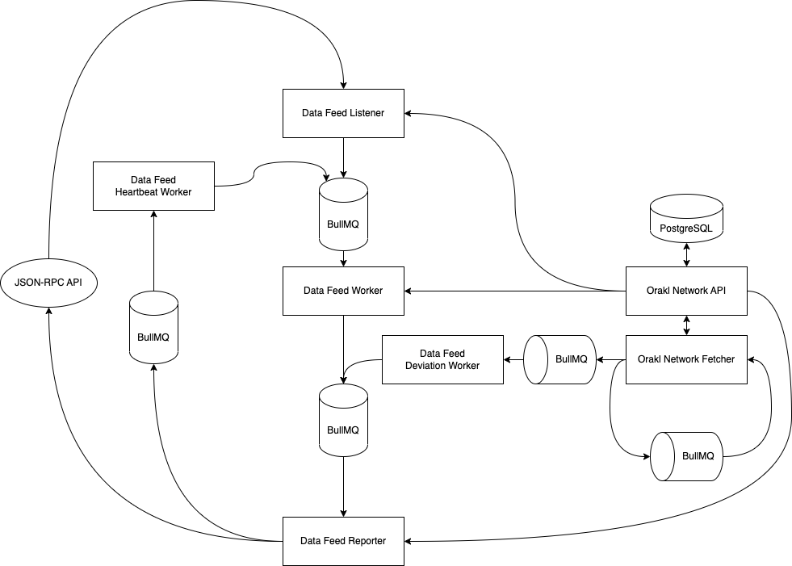

# Orakl Network Data Feed

## Description

The **Orakl Network Data Feed** is one of the main Orakl Network solutions. The goal of the **Orakl Network Data Feed** is to provide frequent data updates from off-chain to on-chain. The data feed is created from a submission pool that is composed of most up-to-date values reported by verified node operators.

A single data feed is defined by a pair of an adapter and an aggregator, and can be accessed on-chain through a `AggregatorProxy` smart contract. The `AggregatorProxy` is an auxiliary contract that redirects read requests to `Aggregator` contract. The `Aggregator` contract holds all submissions from all node operators, and aggregated value that is served to consumers through `AggregatorProxy` contract.

Every data feed has configuration that describes the least frequent update interval called `heartbeat`, minimum deviation threshold (`deviationTreshold`), and minimum absolute threshold (`absoluteThreshold`). Data feed is updated in rounds which can be started by any of **Orakl Network Data Feed** node operators. Once the round is started, every node operator has to submit their latest observed value for the specific data feed. The first submitted transaction that opens a new round emits a `NewRound` event which is captured by the node operators running the **Orakl Network Data Feed Listener** microservice. The `NewRound` event includes a `roundId` value representing the ID of the newly started round. It is possible that **Orakl Network Data Feed Worker** is already processing the round of the same ID. If that is the case, listener will drop the request, otherwise it will be pass it to worker. The requests coming to the **Orakl Network Data Feed Worker** can include information about the round ID but does not have to.

* If the worker request includes the `roundId`, worker only asks the **Orakl Network API** for the latest data feed value aggregated from all observed data sources.
* If the worker request does not include the `roundId` (e.g. coming either due to `heartbeat` , `deviationThreshold` or `absoluteTreshold`), then the worker first asks `Aggregator` which round is currently open, and additionally it fetches the latest data feed value aggregate through the **Orakl Network API** .

After the worker knows which `roundId` it can report on, and after it has access to the latest value aggregate of data feed, it passes the job to the **Orakl Network Data Feed Reporter**. The reporter creates a transaction that contains the data accepted from worker, and reports it to the `Aggregator` contract. Lastly, the reporter creates a time delayed job to automatically start a next round in `heartbeat` milliseconds. If there exists any idle delayed job from previous submissions for the same data feed, it is replaced with the latest one.

The `deviationThreshold` and `absoluteTreshold` trigger events for a new data feed round are executed from the **Orakl Network Fetcher**.

The code is located under [`core` directory](https://github.com/Bisonai/orakl/tree/master/core), and separated to three independent microservices: listener, worker and reporter.

## State Setup

The **Orakl Network Data Feed** requires an access to state of listeners, adapters and aggregators.

### Listener

The **Orakl Network API** holds information about all listeners. The command below adds a single Aggregator listener to the Orakl Network state to listen on `aggregatorAddress` for `NewRound` event. The `chain` parameter specifies a chain on which we expect to operate with the **Orakl Network Data Feed Listener**.

```sh
orakl-cli listener insert \
    --service Aggregator \
    --chain ${chain} \
    --address ${aggregatorAddress} \
    --eventName NewRound
```

### Adapter & Aggregator

```sh
orakl-cli adapter insert \
    --file-path ${adapterJsonFile}

orakl-cli aggregator insert \
    --chain ${chain} \
    --file-path ${aggregatorJsonFile}
```

## Configuration

Before we launch the **Orakl Network Data Feed**, we must specify [several environment variables](https://github.com/Bisonai/orakl/blob/master/core/.env.example). The environment variables are automatically loaded from a `.env` file.

* `NODE_ENV=production`
* `ORAKL_NETWORK_API_URL`
* `CHAIN`
* `HEALTH_CHECK_PORT`
* `SLACK_WEBHOOK_URL`
* `LOG_LEVEL`
* `LOG_DIR`
* `REDIS_HOST`&#x20;
* `REDIS_PORT`
* `HOST_SETTINGS_LOG_DIR`

## Launch

Before launching the Data Feed solution, the **Orakl Network API** has to be accessible from the **Orakl Network Data Feed** to load listener and adapter-aggregator settings.

After the **Orakl Network API** is healthy, Data Feed microservices (listener, worker, reporter) can be launched in an arbitrary order. Microservices communicate with each other through the BullMQ - job queue.

```sh
yarn start:listener:aggregator
yarn start:worker:aggregator
yarn start:reporter:aggregator
```

## Architecture

<figure><figcaption><p>Orakl Network Data Feed</p></figcaption></figure>
