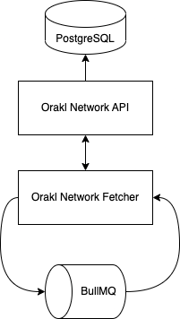

# Orakl Network Fetcher

## Description

The Orakl Network Fetcher is an auxiliary service for Data Feed solution to collect the most up-to-date data from various sources.&#x20;

The code is located under [`fetcher` directory](https://github.com/Bisonai/orakl/tree/master/fetcher).

## State Setup

### Adapter & Aggregator

The **Orakl Network Fetcher** and the [**Orakl Network Data Feed**](orakl-network-data-feed.md) are configured with **adapter** and **aggregator** abstractions. Every data feed collected by the **Orakl Network Fetcher** and then submitted to on-chain by the **Orakl Network Data Feed** is defined with an adapter-aggregator pair. Adapters and aggregators are defined in JSON format. You can find a detailed description of them below.

An **adapter** is a set of data sources (`feeds`) and post-processing rules (`reducers`) that are applied on data received from `feeds`. Additionally, every adapter has a `name`, `decimals` and an `adapterHash`. `decimals` property represents a number of decimal points in which the post processed values are  encoded. The values itself are in an `integer` format and decimal points are stored separately. Lastly, `adapterHash` is computed from all properties of adapter except the `adapterHash` itself. It was defined for safety reasons so nobody can accidentally modify the adapter without anybody noticing.

```json
{
  "adapterHash": "0xe63985ed9d9aae887bdcfa03b53a1bea6fd1acc58b8cd51a9a69ede43eac6235",
  "name": "BTC-USD",
  "decimals": 8,
  "feeds": [
    {
      "name": "Binance-BTC-USD",
      "definition": {
        "url": "https://api.binance.us/api/v3/ticker/price?symbol=BTCUSD",
        "headers": {
          "Content-Type": "application/json"
        },
        "method": "GET",
        "reducers": [
          {
            "function": "PARSE",
            "args": [
              "price"
            ]
          },
          {
            "function": "POW10",
            "args": 8
          },
          {
            "function": "ROUND"
          }
        ]
      }
    }
  ]
}
```

An **aggregator** is described with on-chain metadata (`address`), off-chain metadata (`name`, `heartbeat`, `threshold`, `absoluteThreshold`), and connection to an adapter (`adapterHash`). `address` corresponds to deployed smart contract `Aggregator` that accepts submissions from whitelisted node operators for a data feed defined using an adapter that is identified with `adapterHash`. `name` offers a description of the aggregator. `heartbeat` defines the lowest frequency update (value is denoted in milliseconds) of `Aggregator` smart contract. `threshold` represents a minimum required value deviation (e.g. 0.05 equals to ±5 % deviation) in the data feed that leads to early submission to data feed. When the range of possible values in data feed is between 0 and ∞, `absoluteThreshold` is used to define a minimum absolute change that must be observed before the data feed starts being updated again after the data feed value became a zero. `adapterHash` represents a unary relationship between aggregator and adapter.

```json
{
  "aggregatorHash": "0xfda8c08a8b7641e001ad23c0fb363a9e7aab1e3a7eb8a6ddee41deeb7e3ef279",
  "name": "BTC-USD",
  "address": "0x15c0b3ea93ed4de0a1f93f4ae130aefd8f2e8ccb",
  "heartbeat": 15000,
  "threshold": 0.05,
  "absoluteThreshold": 0.1,
  "adapterHash": "0xe63985ed9d9aae887bdcfa03b53a1bea6fd1acc58b8cd51a9a69ede43eac6235"
}
```

### Add Adapter & Aggregator

If there are no adapters and aggregators in Orakl Network state, you can create them through the **Orakl Network CLI**. To find out, if there are any adapter and aggregator in Orakl Network state, you can execute the command below.

```
orakl-cli adapter list
orakl-cli aggregator list
```

Agregators are associated with `chain`, therefore if you have not defined any chain through the **Orakl Network API** yet, you need to do it before adding any aggregator.

```sh
orakl-cli chain insert --name localhost
```

An example of adding adapter and aggregator to `localhost` chain is shown at the code listing below. Please note that `adapterHash` in adapter and aggregator JSON files has to be same, otherwise they would not be associated. If you try to add aggregator with `adapterHash` that has not been registered, the operation will be aborted.

```sh
orakl-cli adapter insert \
    --file-path [path/to/adapter.json]

orakl-cli aggregator insert \
    --file-path [path/to/aggregator.json] \
    --chain localhost
```

### Activate Aggregator

After the adapters and aggregators are registered to Orakl Network state, they are in an inactive state at first. If we want them to use for data collection, we have to activate them. Activation can be performed through the **Orakl Network CLI**.

```sh
orakl-cli fetcher start \
    --id ${aggregatorhash} \
    --chain ${chainName}
```

### Deactivate Aggregator

Data collection defined with an adapter-aggregator pair can be stopped anytime by executing a command below with appropriate `aggregatorHash`.

```sh
orakl-cli fetcher stop \
    --id ${aggregatorHash} \
    --chain ${chainName}
```

## Configuration

Before we launch the **Orakl Network Fetcher**, we must specify [several environment variables](https://github.com/Bisonai/orakl/blob/master/fetcher/.env.example). The environment variables are automatically loaded from a `.env` file.

* `REDIS_HOST`
* `REDIS_PORT`
* `ORAKL_NETWORK_API_URL`
* `APP_PORT`

`REDIS_HOST` and `REDIS_PORT` represent host and port of [Redis](https://redis.io/) to which the **Orakl Network Fetcher** connect to. The default values are `localhost` and `6379`, respectively. Redis is used indirectly through [BullMQ](https://docs.bullmq.io/) to collect data in regular predefined intervals.&#x20;

`ORAKL_NETWORK_API_URL` corresponds to url where the **Orakl Network API** is running. Collected and aggregated data by the **Orakl Network Fetcher** will be send to [PostgreSQL](https://www.postgresql.org/) through the **Orakl Network API** interface.

`APP_PORT` represents a port on which the **Orakl Network Fetcher** will be running. This port will be necessary when we connect to **Orakl Network API** from other services (e.g. **Orakl Network CLI**).

## Launch

To launch the **Orakl Network Fetcher** from source code in the production, one must first build the service, and then it can be launched.

```sh
yarn build
yarn start:prod
```

After the **Orakl Network Fetcher** is launched, all active aggregators will start to

* collect data for each data source defined in adapter feeds of activated aggregator, and
* compute and store their aggregate.

The collected and computed data are sent through the **Orakl Network API** to PostgreSQL. Aggregators can be [actived](orakl-network-fetcher.md#activate-aggregator) and [deactivated](orakl-network-fetcher.md#deactivate-aggregator) while the **Orakl Network Fetcher** is running.

## Architecture

<figure><figcaption><p>Orakl Network Fetcher</p></figcaption></figure>
