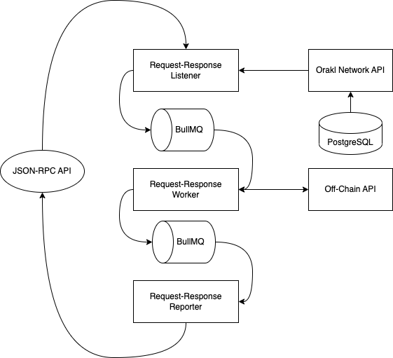

# Orakl Network Request-Response

## Description

The **Orakl Network Request-Response** is one of the main Orakl Network solutions. It provides an access to off-chain data from on-chain smart contracts. Requests are emitted through on-chain event, captured by the **Orakl Network Request-Response Listener**, processed by the **Orakl Network Request-Response Worker** and eventually responded back to on-chain through the **Orakl Network Request-Response Reporter**.

The code is located under [`core` directory](https://github.com/Bisonai/orakl/tree/master/core), and separated to three independent microservices: listener, worker and reporter.

## State Setup

The **Orakl Network Request-Response** requires an access to state only for listeners.

### Listener

The **Orakl Network API** holds information about all listeners. The command below adds a single Request-Response listener to the Orakl Network state to listen on `requestResponseCoordinatorAddress` for `DataRequested` event. The `chain` parameter specifies a chain on which we expect to operate with the **Orakl Network Request-Response Listener**.

```sh
orakl-cli listener insert \
    --service RequestResponse \
    --chain ${chain} \
    --address ${requestResponseCoordinatorAddress} \
    --eventName DataRequested
```

## Configuration

Before we launch the **Orakl Network Request-Response**, we must specify [several environment variables](https://github.com/Bisonai/orakl/blob/master/core/.env.example). The environment variables are automatically loaded from a `.env` file.

* `NODE_ENV=production`&#x20;
* `ORAKL_NETWORK_API_URL`
* `CHAIN`&#x20;
* `HEALTH_CHECK_PORT`
* `SLACK_WEBHOOK_URL`
* `LOG_LEVEL`
* `LOG_DIR`
* `REDIS_HOST`
* `REDIS_PORT`
* `HOST_SETTINGS_LOG_DIR`

## Launch

Before launching the Request-Response solution, the **Orakl Network API** has to be accessible from the **Orakl Network Request-Response** to load listener settings.

After the **Orakl Network API** is healthy, Request-Response microservices (listener, worker, reporter) can be launched in an arbitrary order. Microservices communicate with each other through the BullMQ - job queue.

```sh
yarn start:listener:request_response
yarn start:worker:request_response
yarn start:reporter:request_response
```

## Architecture

The architecture is very similar to the **Orakl Network VRF**. The only difference is that the **Orakl Network Request-Response Worker** fetches and processes data based on the on-chain request.

<figure><figcaption><p>Orakl Network Request-Response</p></figcaption></figure>

