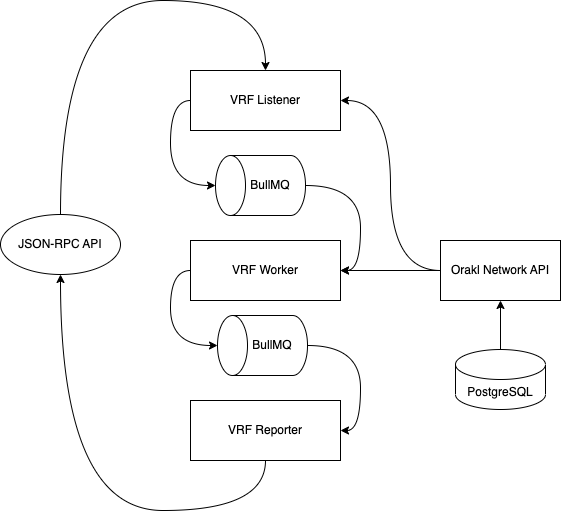

# Orakl Network VRF

## Description

The **Orakl Network VRF** is one of the main Orakl Network solutions. It provides an access to provably random number generator.

The code is located under [`core` directory](https://github.com/Bisonai/orakl/tree/master/core), and separated to three independent microservices: listener, worker and reporter.

## State Setup

The **Orakl Network VRF** requires an access to state of listeners and VRF keys.

### Listener

The **Orakl Network API** holds information about all listeners. The command below adds a single VRF listener to the Orakl Network state to listen on `vrfCoordinatorAddress` for `RandomWordsRequested` event. The `chain` parameter specifies a chain on which we expect to operate with the **Orakl Network VRF Listener**.

```sh
orakl-cli listener insert \
    --service VRF \
    --chain ${chain} \
    --address ${vrfCoordinatorAddress} \
    --eventName RandomWordsRequested
```

### VRF Keys

To be able to run VRF as a node operator, one must have registered VRF keys in [`VRFCoordinator`](https://github.com/Bisonai/orakl/blob/master/contracts/src/v0.1/VRFCoordinator.sol), and VRF keys has to be in Orakl Network state as well. VRF worker will load them from the **Orakl Network API** when it is launched.

If you do not have VRF keys, you can generate them with the **Orakl Network CLI** using the following command.

```sh
orakl-cli vrf keygen
```

The output of generated command will be similar to the one below, but including the keys on the right side of the keys (`sk`, `pk`, `pkX`,`pkY`, and `keyHash`). VRF keys are generated randomly, therefore every time you call the `keygen` command, you receive a different output. `sk` represents a secret key which is used to generate the VRF `beta` and `pi`. This secret key should never be shared with anybody except the required personnel.

```
sk=
pk=
pkX=
pkY=
keyHash=
```

To store VRF keys in Orakl Network state use `orakl-cli vrf insert` command. Parameter `--chain` corresponds to the network name to which VRF keys will be associated.

```sh
orakl-cli vrf insert \
    --chain ${chain} \
    --pk ${pk} \
    --sk ${sk} \
    --pkX ${pkX} \
    --pkY ${pkY} \
    --keyHash ${keyHash}
```

## Configuration

Before we launch the **Orakl Network VRF**, we must specify [several environment variables](https://github.com/Bisonai/orakl/blob/master/core/.env.example). The environment variables are automatically loaded from a `.env` file.

* `NODE_ENV=production`
* `CHAIN`
* `PROVIDER_URL`
* `ORAKL_NETWORK_API_URL`
* `PUBLIC_KEY`
* `PRIVATE_KEY`
* `LOG_LEVEL`
* `LOG_DIR`
* `REDIS_HOST`
* `REDIS_PORT`
* `HEALTH_CHECK_PORT`
* `HOST_SETTINGS_LOG_DIR`
* `SLACK_WEBHOOK_URL`

The **Orakl Network VRF** is implemented in Node.js which uses `NODE_ENV` environment variable to signal the execution environment (e.g. `production`, `development`). [Setting the environment to `production`](https://nodejs.dev/en/learn/nodejs-the-difference-between-development-and-production/) generally ensures that logging is kept to a minimum, and more caching levels take place to optimize performance.

`CHAIN` environment variable specifies on which chain the **Orakl Network VRF** will be running, and which resources will be collected from the **Orakl Network API**.

`PROVIDER_URL` defines an URL string to JSON-RPC endpoint that listener and reporter communicates through.

`ORAKL_NETWORK_API_URL` corresponds to url where the **Orakl Network API** is running. Collected and aggregated data by the **Orakl Network Fetcher** will be send to [PostgreSQL](https://www.postgresql.org/) through the **Orakl Network API** interface.

`PUBLIC_KEY` and `PRIVATE_KEY` environment variables are neccessary for reporter to fulfill incoming request.

Setting a level of logs emitted by a running instance is set through `LOG_LEVEL` environment variable, and can be one of the following: `error`, `warning`, `info`, `debug` and `trace`, ordered from the most restrictive to the least. By selecting any of the available options you subscribe to the specified level and all levels with lower restrictiveness.

Logs are sent to console, and to file which is located at `LOG_DIR` directory.

`REDIS_HOST` and `REDIS_PORT` represent host and port of [Redis](https://redis.io/) to which the **Orakl Network Fetcher** connect to. The default values are `localhost` and `6379`, respectively. Redis is used indirectly through [BullMQ](https://docs.bullmq.io/) to collect data in regular predefined intervals.&#x20;

The **Orakl Network VRF** does not offer a rich REST API, but defines a health check endpoint (`/`) \
served under a port denoted as `HEALTH_CHECK_PORT`.

`HOST_SETTINGS_LOG_DIR`is used in [Docker Compose file](https://github.com/Bisonai/orakl/blob/master/core/docker-compose.vrf.yaml), and represents a location at host where collected file logs will be stored.

Errors and warnings emitted by the **Orakl Network VRF** can be [sent to Slack channels through a slack webhook](https://api.slack.com/messaging/webhooks). The webhook URL can be set with the `SLACK_WEBOOK_URL` environment variable.

## Launch

Before launching the VRF solution, the **Orakl Network API** has to be accessible from the **Orakl Network VRF** to load VRF keys, and listener settings.

After the **Orakl Network API** is healthy, VRF microservices (listener, worker, reporter) can be launched in an arbitrary order. Microservices communicate with each other through the BullMQ - job queue.

```sh
yarn start:listener:vrf
yarn start:worker:vrf
yarn start:reporter:vrf
```

## Architecture

<figure><figcaption><p>Orakl Network VRF</p></figcaption></figure>
